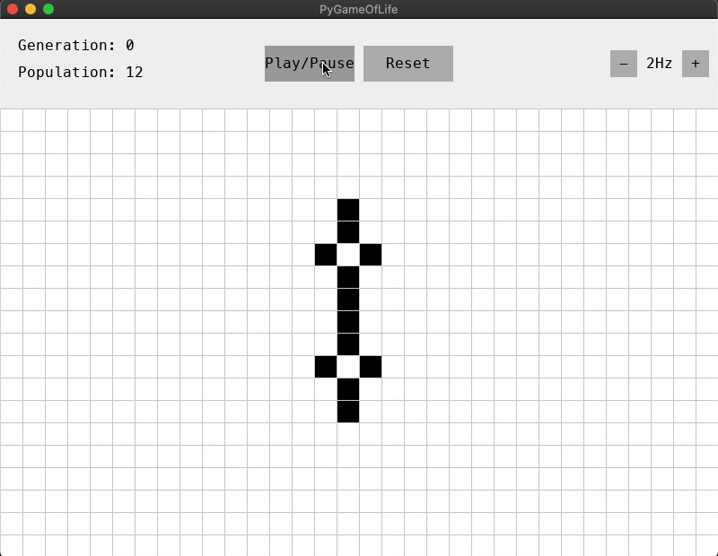

# PyGameOfLife

An implementation of [Conway's Game of Life](https://conwaylife.com/wiki) in PyGame



-------------

## Installation

```
git clone https://github.com/Aniruddha-Deb/PyGameOfLife.git
cd PyGameOfLife
pip install -r requirements.txt
```

## Usage

```
python -m pygameoflife
```

## Instructions:
- Left Click: toggle single cell
- Shift-Click or Shift-drag: activate cell(s)
- Ctrl-Click or Ctrl-drag: deactivate cell(s)
- drag to move grid, scroll to zoom
